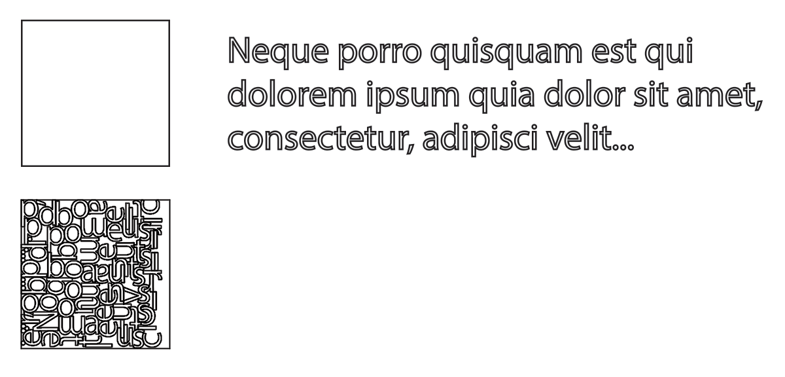
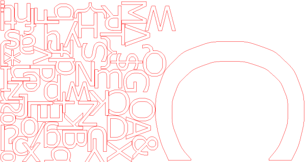
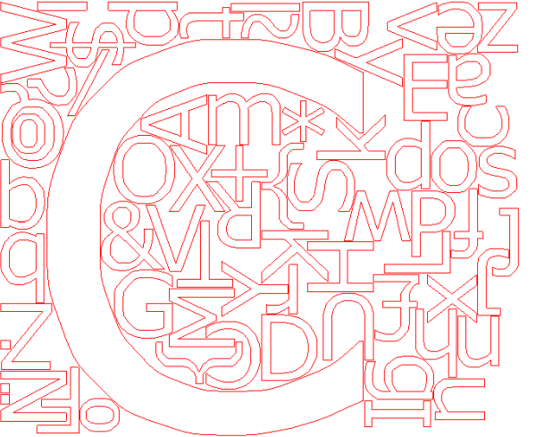
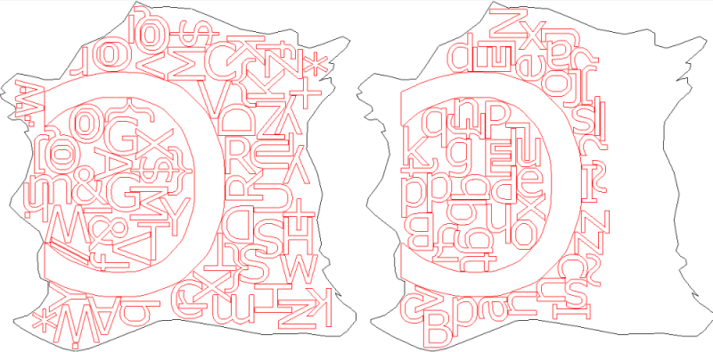
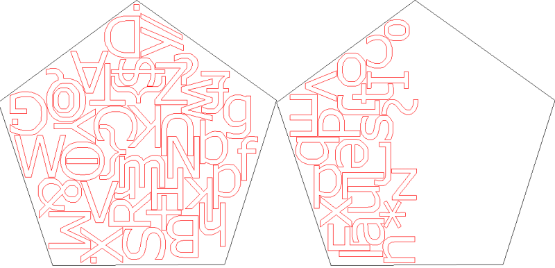
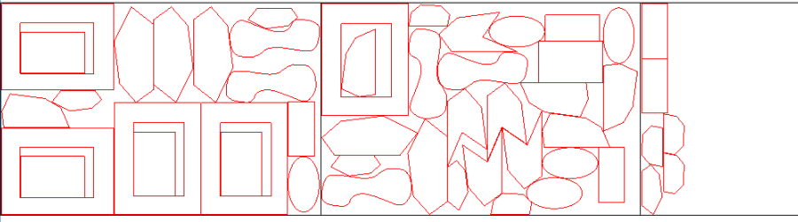

**ZNester**: A polygon nesting tool

references (PDF):
- [Complete and robust no-fit polygon generation for the irregular stock cutting problem](https://pdfs.semanticscholar.org/e698/0dd78306ba7d5bb349d20c6d8f2e0aa61062.pdf)

## What is "nesting"?

Given a square piece of material and some letters to be laser-cut:

We want to pack all the letters into the square, using as little material as possible. If a single square is not enough, we also want to minimize the number of squares used.

ZNester solves this problem with the orbital NFP approach, using a genetic algorithm for global optimization. It also works with arbitrary containers (called bins).

## Outline of algorithm

While [good heuristics](http://cgi.csc.liv.ac.uk/~epa/surveyhtml.html) exist for the rectangular bin packing problem, in the real world we are concerned with irregular shapes.

The strategy is made of two parts:

- the placement strategy (ie. how do I insert each part into a bin?)
- and the optimization strategy (ie. what's the best order of insertions?)

### Placing the part

The key concept here is the "No Fit Polygon".

Given polygons A and B, we want to move (or "orbit") B around A so that they always touch but do not intersect. An arbitrary point of polygon B is used as a reference point. In the following example the "J" shape is polygon B, and the generated NFP is shown in blue.

The resulting polygon is the outer NFP. The NFP contains all possible placements of B. We can then choose a point on the NFP as the placement position. 

For placing a part inside a bin, we similarly construct an inner NFP by "orbiting" B *inside* A.

One problem with the orbiting approach is that it's not fully robust when using `double` precision. In case the orbiting approach fails, we fall back using the Minkowski difference to calculate the NFP.

When two or more parts have already been placed, we can take the union of the NFPs of the previously placed parts.

This means that we need to compute $O(n \log n)$ NFPs to complete the first packing iteration.

Another approach not using NFPs is also possible by placing the parts directly, but this is much slower especially if multiple copies of parts need to be placed because the NFPs can be cached and reused for subsequent placements.

### Optimization

Now that we can place the parts, we need to optimize the insertion order. Here's an example of a bad insertion order:

If the large *"C"* is placed last, the concave space inside it won't be utilized because all the parts that could have filled it have already been placed.

To solve this, we use the "first-fit-decreasing" heuristic. Larger parts are placed first, and smaller parts last. This is quite intuitive, as the smaller parts tend to act as "sand" to fill the gaps left by the larger parts.

While this strategy is a good start, it will give only one result which usually is not the best solution. So for further iterations we have to randomize the insertion order. But fully randomizing does not scale very well, so we use a [genetic algorithm](https://en.wikipedia.org/wiki/Genetic_algorithm) to get faster to a global optimal solution.

## Evaluating fitness

In our genetic algorithm the insertion order and the rotation of the parts form the gene. The fitness function follows these rules:

1. Minimize the number of unplaceable parts (parts that cannot fit into a bin due to rotation)
2. Minimize the number of bins used
3. Minimize the *width* of all placed parts

The last one is chosen due to real-world use: the material to be cut tends to be rectangular or even on a roll, so we want to optimize for width used. We could of course also optimize for smallest bounding box used or for the smallest concave hull.

Small mutations in the gene can cause large changes in overall fitness, especially for non-convex shapes. This leads to individuals of a population to be somewhat similar. Caching the NFPs therefore saves a lot of time.

# Examples

